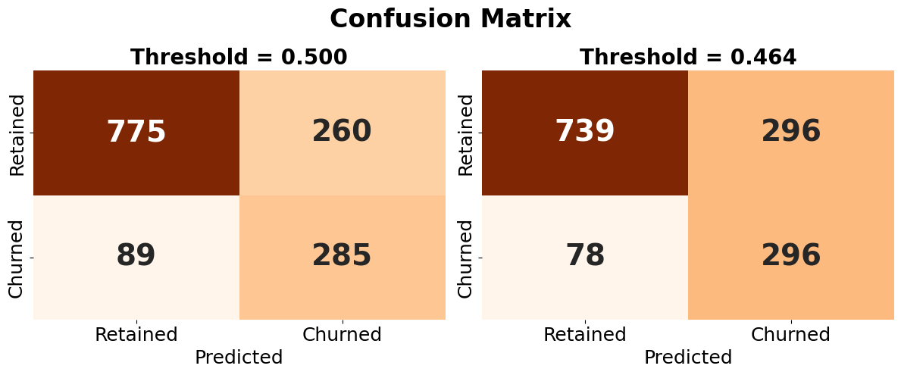
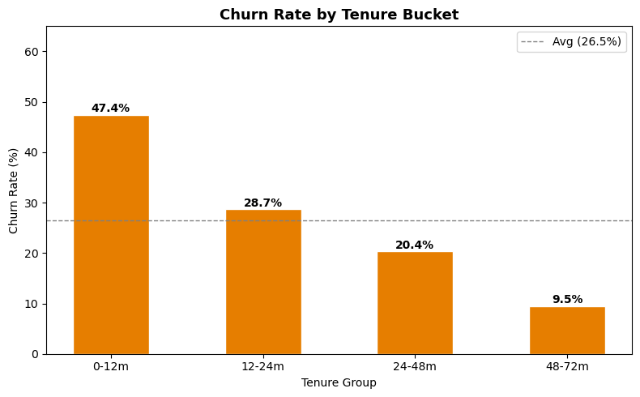
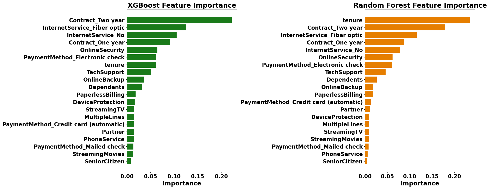

# Telco Customer Churn Prediction

Predicting which telecom customers are about to leave, and deciding how aggressively to act on that prediction when missing a churner costs more than a false alarm.

**Main finding:** four models, from logistic regression to a neural network, all land within one percentage point of each other (ROC-AUC 0.834–0.841 on the test set). On a tabular dataset of this size, the choice of model barely matters. The data sets the ceiling, and the decision that actually matters is where you set the classification threshold.

## The business question

A telecom operator wants to target retention offers at customers likely to churn. The costs are asymmetric. A missed churner means lost recurring revenue, while a wrongly flagged loyal customer only costs the price of an offer. So the model has two jobs: rank customers well by risk, and support a sensible cut-off for who gets contacted.

## Data

The [IBM Telco Customer Churn dataset](https://www.kaggle.com/datasets/blastchar/telco-customer-churn) has 7,043 customers and 21 columns covering demographics, account information and subscribed services. 26.5% of customers churned.

The dataset is not included in this repo. Download `WA_Fn-UseC_-Telco-Customer-Churn.csv` from Kaggle and place it in the repo's root folder, next to the notebook.

## Approach

1. **EDA.** Churn rates were broken down by demographics, contract, billing and services, together with correlation and association analysis (point-biserial correlation, Cramér's V).
2. **Preprocessing.** Identifier and multicollinear columns were dropped. Redundant "no internet/phone service" categories were collapsed, and multi-category variables were one-hot encoded. The data was split 60/20/20 into train, validation and test sets. The scaler was fitted on the training set only, and SMOTE oversampling was applied to the training set only, to avoid leakage.
3. **Models.** Logistic regression, random forest and XGBoost were tuned with `GridSearchCV` (5-fold, ROC-AUC). The neural network was a Keras MLP with two hidden layers (32 and 16 units), trained with dropout, L2 regularisation and early stopping. Learning curves were used to diagnose overfitting. The first random forest and XGBoost fits overfit badly and were re-tuned with stronger regularisation.
4. **Threshold selection.** For the chosen model, the threshold was lowered as far as possible while keeping precision at or above 50%. The idea is that at least one in two customers contacted should be a genuine churn risk.

## Results

Test set results for the churn class:

| Model | Precision | Recall | F1 | ROC-AUC |
|---|---|---|---|---|
| Logistic Regression | 0.51 | 0.76 | 0.61 | 0.834 |
| **Random Forest** | 0.52 | 0.76 | 0.62 | **0.841** |
| XGBoost | 0.52 | 0.75 | 0.62 | 0.838 |
| Neural Network | 0.52 | 0.79 | 0.63 | 0.837 |

Random forest was selected on validation ROC-AUC. However, logistic regression gets within a point of it while tuning in 3 seconds instead of about 1 minute and staying fully interpretable. On a much larger dataset, it would likely be the more practical choice.

**Moving the threshold from 0.50 to 0.464** catches 11 more churners (false negatives fall from 89 to 78) at the cost of 36 more loyal customers receiving an offer:

**What drives churn:** contract type, tenure, internet service type and protective add-ons (online security, tech support). The three models agree on these drivers even though they rank them differently. Nearly half of all churn happens in the first 12 months.

## What I'd do differently

- **Set the threshold from costs rather than a round number.** If retaining a customer is worth *X* and an offer costs *Y*, the break-even precision is *Y/X*. The 50% floor stood in for missing cost data. With real customer lifetime value and offer costs, this becomes a proper expected-value decision.
- **Get more data before more tuning.** The learning curves for random forest and XGBoost were still rising at full training size. More data would likely help more than further hyperparameter tuning.
- **Make the whole pipeline reproducible in one environment.** The neural network was trained in Google Colab, so those cells are commented out in the notebook.

This was the final project for *Machine Learning and Deep Learning* in the MSc Business Administration and Data Science programme at Copenhagen Business School (spring 2026). It was co-authored with **Daniel Gazany**, and both authors contributed to the analysis and the report.
